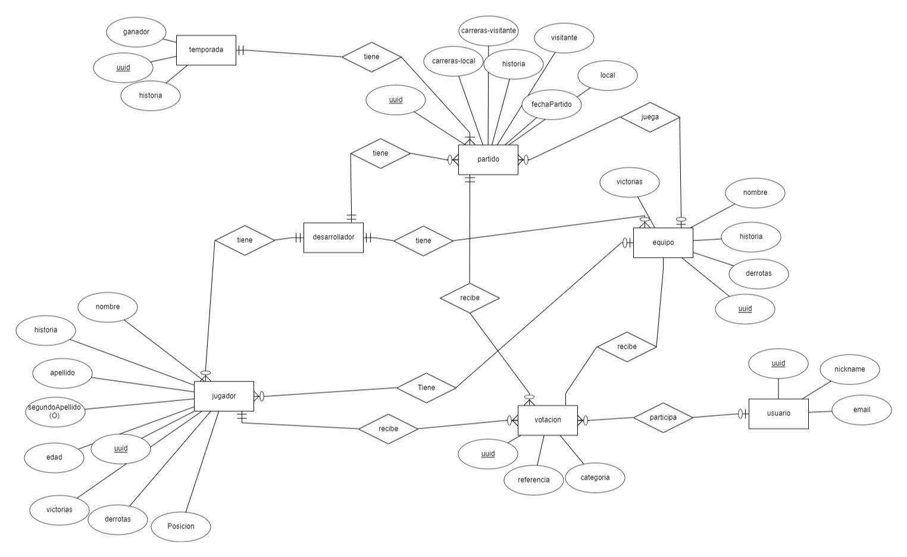

# Anteproyecto TFG 2º DAM 2024

# Título del proyecto

HomeSlam

# Nombre de los autores del proyecto

Marco Valente

# Descripción

HomeSlam es un simulador de baseball de fantasía basado en texto en el que los desarrolladores crean una liga de baseball de fantasía y a traves de votaciones y decisiones semanales por parte de los jugadores se irán relatando y desarrollando los diferentes partidos ficticios con resultados basados en las votaciones realizadas por parte de los jugadores.

# Objetivos del proyecto

Crear un simulador en el que el jugador sienta que tenga suficientes decisiones para tomar sobre el futuro de su equipo o jugadores y que los desarrolladores puedan recibir, recopilar y usar estas decisiones correctamente para cuando deban relatar y actualizar el estado de la liga semanalmente.

# Tecnologías utilizadas

Frontend: 

- Angular con Ionic para la app web
- Android con Kotlin para la app movil

Backend:

Para la base de datos y guardar recursos se utilizará Firebase

# Esquema E/R de la base de datos

# Repositorios:

- Repositorio de la app web:
    - [https://github.com/Kuzafkto/HomeSlam-Firebase](https://github.com/Kuzafkto/HomeSlam-Firebase)
    
- Repositorio de la app movil:
    - [https://github.com/Kuzafkto/HomeSlam-Kotlin](https://github.com/Kuzafkto/HomeSlam-Kotlin)
